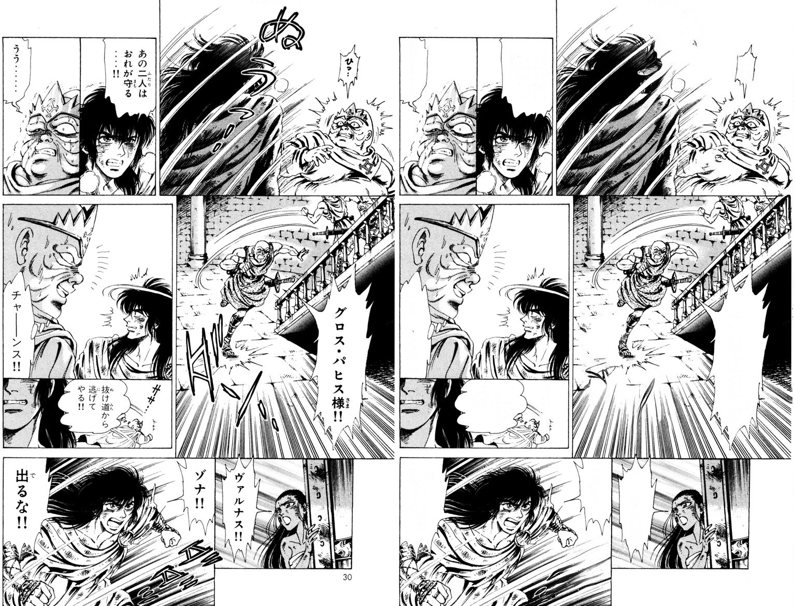
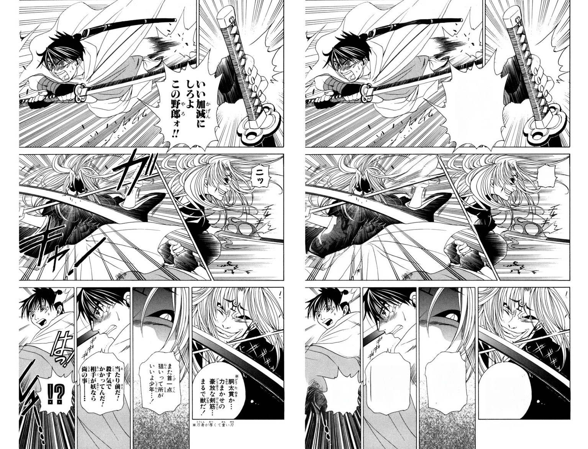

<!--
 * @Author: 
 * @Date: 2023-07-27 09:45:59
 * @LastEditors: 
 * @LastEditTime: 2023-07-27 09:50:16
 * @Description: file content
-->
SickZil-Machine-DirectML
===============
[英语](README.md) | [韩语](README.ko_kr.md) | 汉语

注意
------
[SZMC 0.1.1](https://github.com/KUR-creative/SickZil-Machine/releases) - 修复了链接 \
[教程和技巧](https://github.com/KUR-creative/SickZil-Machine/blob/master/doc/tips/tips-0.1.1-eng.md)

目前，我仍在研究 SickZil-Machine。 它只是奠定了用户看不见的基础。 我正在构建我需要的系统，以实现更有效的训练数据收集、更高效的深度学习模型训练、更快的实验和分析、模型服务和部署自动化等。\
我将走向远方。 如果您能再等一会儿，我将不胜感激。 谢谢。

（来源：[manga109](http://www.manga109.org)，©菅野浩，©奥田桃子，©加藤正树）

SickZil-Machine **在漫画/漫画翻译（扫描）过程中自动删除文本**。
  
  

以上所有图像都是自动编辑的，无需人工干预。\
（来源：[manga109](http://www.manga109.org)、©岛崎柚、©赤松健、©小林由纪）

怎么运行的？？
-----
### 模型

SickZil-Machine 找出漫画/漫画中的文本并自然地将其擦除以匹配背景。\
**这两个过程都是完全自动的**，无需任何额外的人工干预。\
当然，如果您愿意，您也可以指定要擦除的文本区域。

顺便说一下，SickZil 是韩语单词 식질，식자(작업) 的俚语。
식자 表示根据翻译（来自译者）编辑漫画/漫画。

我们将[U-net](https://arxiv.org/abs/1505.04597)应用于SegNet，将[Deepfill v2](http://jiahuiyu.com/deepfill2/)应用于ComplNet。

### 数据集
SickZil-Machine 由两个深度学习模型组成：SegNet 和 ComplNet。

要学习**SegNet**，我们需要**原始漫画图像**和\
**文本组件蒙版**覆盖与原始图像对应的所有文本区域。

为了学习**ComplNet**，我们需要**删除文本的漫画图像**（即**输出**）。 \
（我正在研究带有少量文本的图像如何影响性能。\
完全没有文本的漫画图像是理想的数据。）

版本 0.1.1 使用 285 个图像掩模对和 31,497 个漫画图像进行训练。 \
（31,497 个漫画图像中的 11,464 个是带有文本的图像。）

如果您想向 SickZil-Machine 贡献数据集，请将您的数据发送至<a href="mailto:kur.creative.org@gmail.com">电子邮件</a>。 \
该数据集仅用于研究目的。

发布（不适用于DirectML，请观看“运行代码（供开发人员使用）”）
-----
**我们发布了0.1.1预发布版本！** \
[您可以在这里下载SZMC](https://github.com/KUR-creative/SickZil-Machine/releases)。 \
[教程和提示在这里。](https://github.com/KUR-creative/SickZil-Machine/blob/master/doc/tips/tips-0.1.1-eng.md)

SickZil-Machine 并不是一个完美的程序。 我们需要你的帮助。 \
如果您发现错误或有建议，请打开 [Github 问题](https://github.com/KUR-creative/SickZil-Machine/issues) 或向我们发送 <a href="mailto:kur.creative .org@gmail.com">电子邮件</a>。

运行代码（供开发人员使用）
----

本机 Windows 上的 TensorFlow with DirectML 包从 Windows 10 版本 1709（内部版本 16299 或更高版本）开始运行。 您可以通过运行命令（Windows 徽标键 + R）运行 winver 来检查您的版本号。 （tensorflow-directml 1.15.0 要求）

0. `git clone https://github.com/Aloereed/SickZil-Machine-DirectML.git; cd SickZil-Machine-DirectML`
1. 从[此处](https://github.com/KUR-creative/SickZil-Machine/releases)下载发布 zip 文件之一。
2.解压release文件并复制`SickZil-Machine-0.1.1-pre0-win64-cpu-eng/resource/cnet`和`SickZil-Machine-0.1.1-pre0-win64-cpu-eng/resource/snet ` 目录到 `SickZil-Machine-DirectML/resource`。
3.`cd src； pip install -r requests.txt`
4.`python main.py`

未来的作品
-----
- 提高文本分割性能
- 打开漫画文本分割掩模数据集
- 自动排版（书法风格学习）

 
 
 